<div align="center">

# 🚗 ParkPin
### *Park it. Pin it. Find it.*

**A modern, intuitive, and feature-packed Flutter application designed to make losing your parked vehicle a thing of the past.**

[](https://flutter.dev/)
[](https://dart.dev/)
[](https://pub.dev/packages/provider)
[](https://flutter.dev)
[](LICENSE)
[](https://github.com/rztech11/ParkPin/stargazers)

<br/>

<p align="center">
  <a href="#-overview">Overview</a> •
  <a href="#-features">Features</a> •
  <a href="#-uiux-showcase">UI/UX Showcase</a> •
  <a href="#%EF%B8%8F-architecture--tech-stack">Tech Stack</a> •
  <a href="#-project-structure">Project Structure</a> •
  <a href="#-getting-started">Getting Started</a> •
  <a href="#-configuration--permissions">Permissions</a> •
  <a href="#-contributing">Contributing</a>
</p>

---

</div>

## 📌 Overview

Ever found yourself wandering endlessly through multi-level basement parking lots, crowded shopping mall garages, or massive airport terminals trying to remember where you left your vehicle?

**ParkPin** solves this with precision, simplicity, and elegance. With one single tap, **ParkPin** locks your exact GPS coordinates, allows you to record floor, section, pillar/slot numbers, attach reference landmark photos, set parking meter alarm reminders, and guides you directly back to your spot with live turn-by-turn map navigation.

---

## ✨ Features

- 📍 **One-Tap Instant Pinning**: High-accuracy GPS geolocation lock with visual radar pulse detection and accuracy status indicators.
- 🏢 **Multi-Level Garage Tagging**: Dedicated metadata fields for Place Name, Floor (e.g., *Basement 2*), Section (*Section C*), Parking Slot (*Slot 42*), and custom notes.
- 📸 **Visual Landmark Memory**: Snap or upload photos of pillars, floor numbers, or landmarks to ensure instant visual recognition.
- ⚠️ **Smart Collision Detection**: Intelligent warning dialog preventing accidental overwrites when an active parking session is already running.
- ⏱️ **Live Session Duration**: Real-time active parking dashboard displaying a live stopwatch timer for elapsed parking time.
- 🗺️ **Interactive Map Navigation**: Embedded OpenStreetMap routing with live distance calculation (meters/kilometers) and estimated walking time.
- 🌐 **External Navigation Support**: Launch directly into Google Maps or Apple Maps for external turn-by-turn routing with one tap.
- 🔔 **Smart Expiry Reminders**: Schedule custom notifications (15 mins, 30 mins, 1 hour, 2 hours, or custom countdown) to avoid costly parking meter tickets.
- 📜 **Parking History Archive**: Comprehensive timeline of past parking spots with timestamped details, photos, reverse geocoded addresses, and quick one-tap map recall.
- 🔒 **Privacy-First & Offline Ready**: All location data and photos are stored strictly on your local device without external tracking.
- 🎨 **Modern Minimalist UI**: Built according to Material Design 3 guidelines with fluid animations, haptic feedback, custom dialogs, and responsive layouts.

---

## 📱 UI/UX Showcase

### 🚀 1. Onboarding & First Impression
Seamless introduction with fluid animations and zero setup friction.

| Splash Screen | Onboarding Experience | Ready To Park (Home) |
|:---:|:---:|:---:|
| 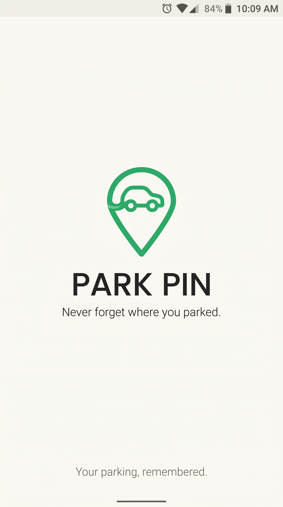 | 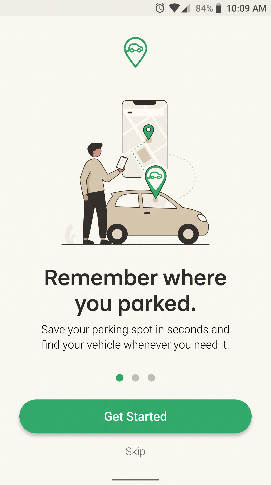 | 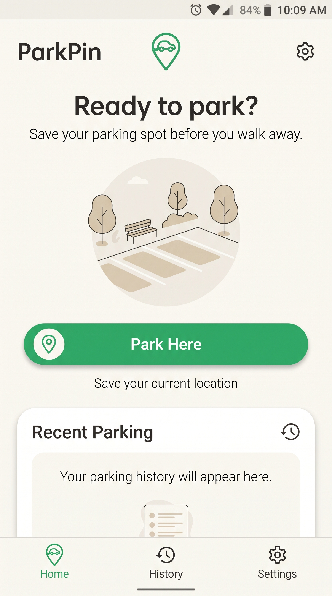 |
| *Branded Splash Screen* | *Quick 3-step feature tour* | *Clean home state ready to pin* |

<br/>

### 📍 2. Pinning Your Parking Spot
Fast GPS auto-detection, comprehensive location metadata, and visual photo capture.

| Finding Location | Spot Details Form | Photo Capture | Parking Confirmed |
|:---:|:---:|:---:|:---:|
| 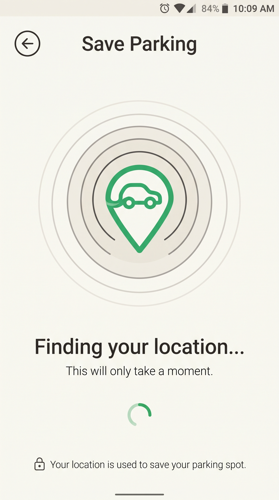 | 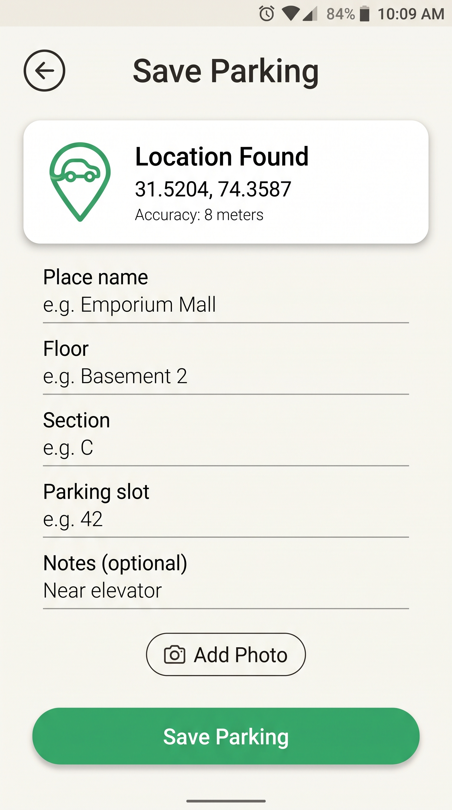 | 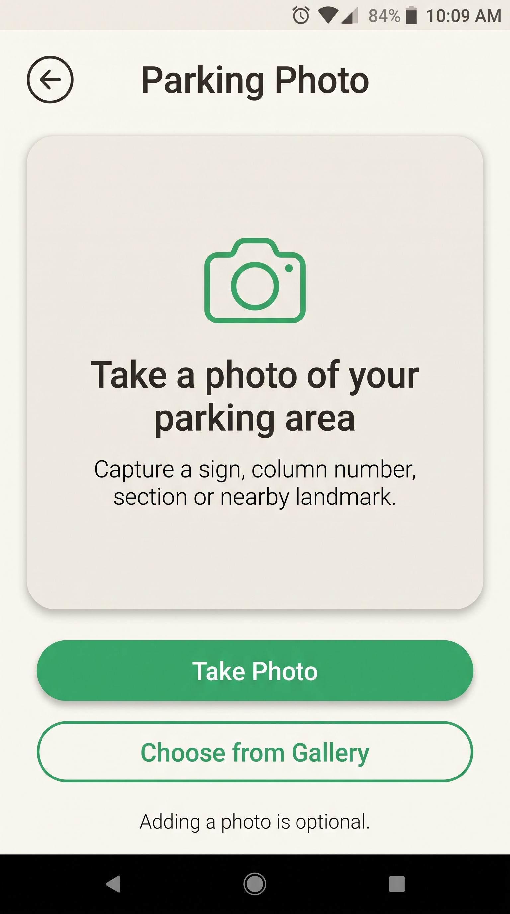 | 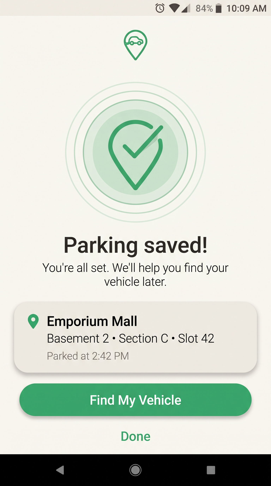 |
| *Live radar GPS lock* | *Floor, slot & section inputs* | *Camera & gallery support* | *Instant confirmation* |

<br/>

### 🧭 3. Active Session & Live Map Guidance
Real-time tracking of parking duration and interactive walk navigation.

| Active Parking Dashboard | Live Route Navigation | End Parking Confirmation |
|:---:|:---:|:---:|
| 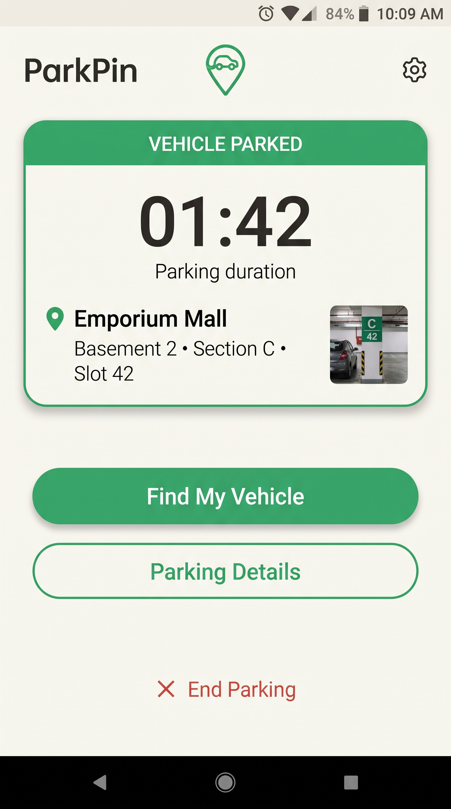 | 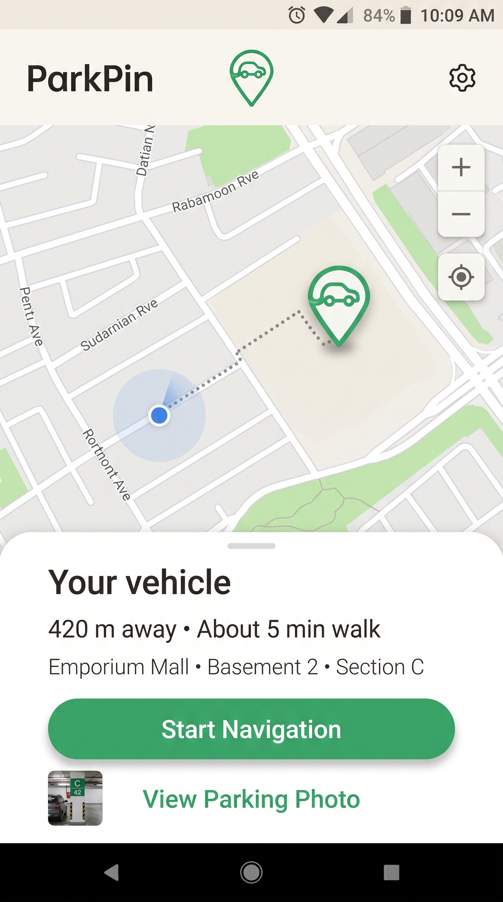 | 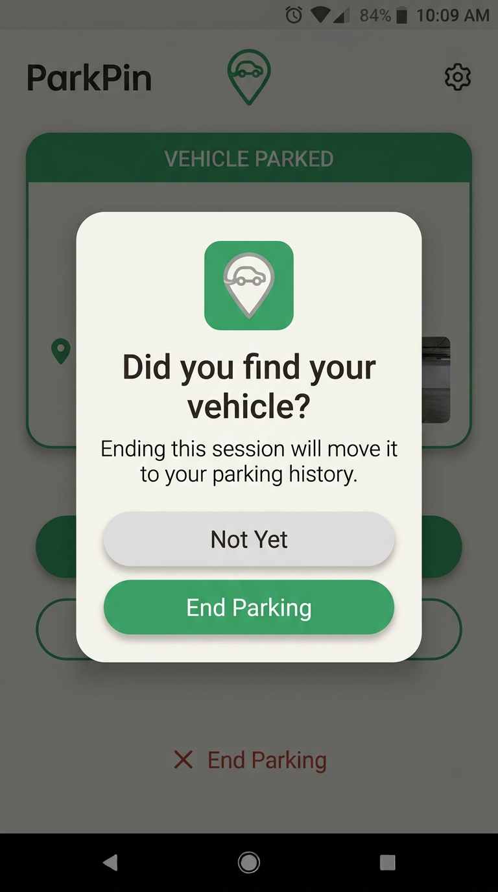 |
| *Live stopwatch & summary* | *Turn-by-turn walking distance* | *Session completion dialog* |

<br/>

### 🗂️ 4. History, Reminders & Settings
Effortlessly review past visits, customize parking meter alerts, and configure preferences.

| Parking History | Session Details | Parking Reminder Timer | App Settings |
|:---:|:---:|:---:|:---:|
| 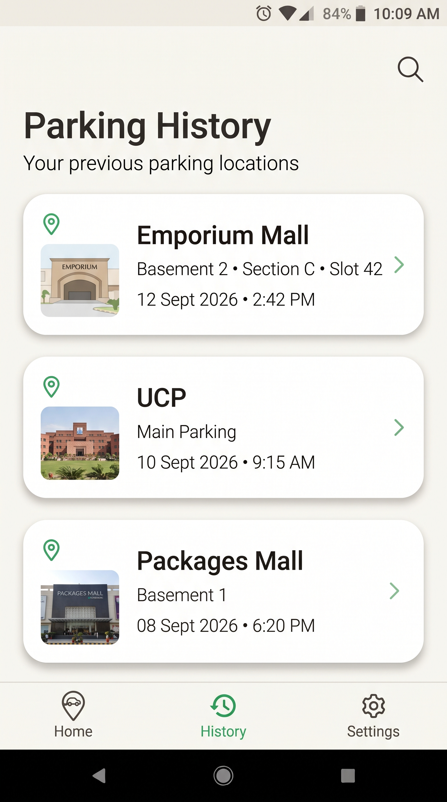 | 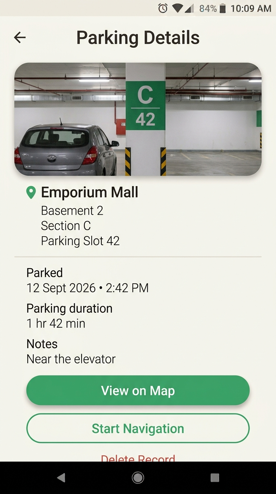 | 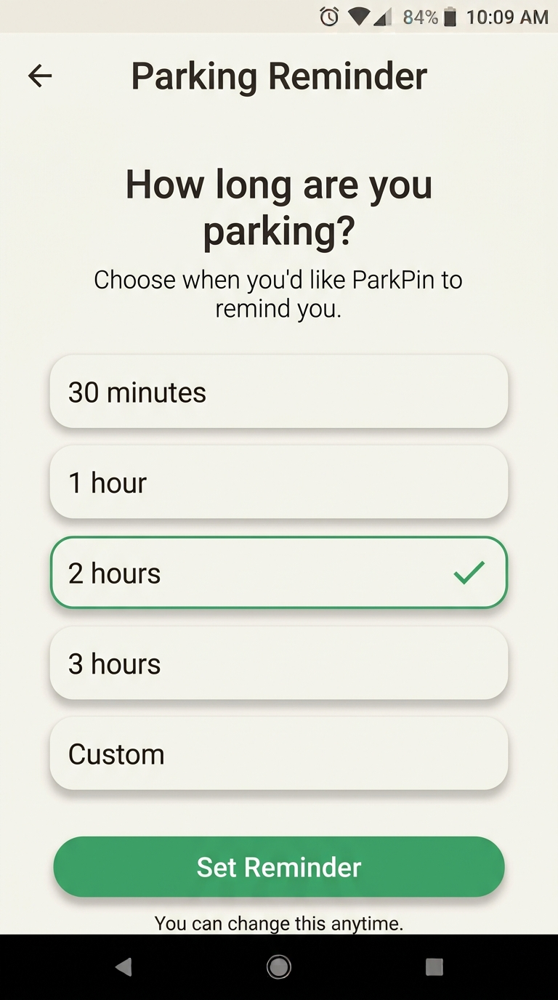 | 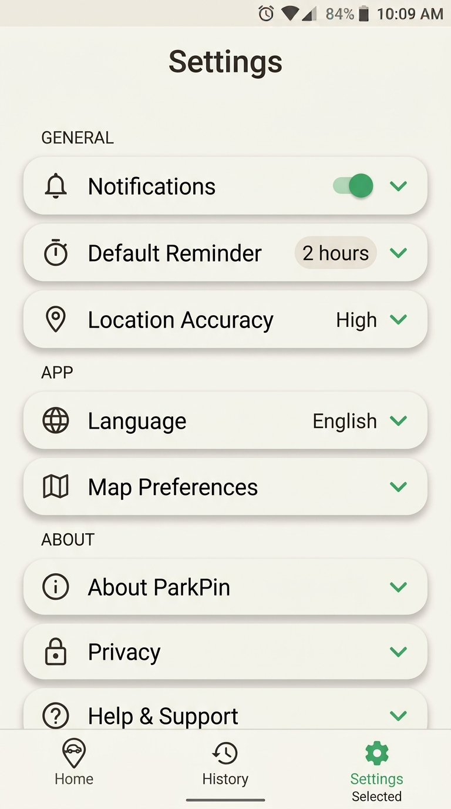 |
| *Timeline of saved spots* | *Complete spot breakdown* | *Custom alarm intervals* | *Preferences & accuracy* |

---

## 🛠️ Architecture & Tech Stack

ParkPin is engineered following Clean Architecture and Provider-based State Management principles for maintainability, testability, and responsiveness.

```
                      ┌─────────────────────────┐
                      │      UI / Views         │
                      │  (Screens & Widgets)    │
                      └────────────┬────────────┘
                                   │
                                   ▼
                      ┌─────────────────────────┐
                      │    State Providers      │
                      │(Parking, Location, Set) │
                      └────────────┬────────────┘
                                   │
                                   ▼
                      ┌─────────────────────────┐
                      │    Core Services        │
                      │(GPS, Notifs, Storage,   │
                      │ Navigation Launcher)    │
                      └─────────────────────────┘
```

### 🧰 Key Packages & Dependencies

| Package | Version | Purpose |
|:---|:---|:---|
| [`provider`](https://pub.dev/packages/provider) | `^6.1.2` | Reactive State Management & Dependency Injection |
| [`flutter_map`](https://pub.dev/packages/flutter_map) | `^7.0.2` | Lightweight OpenStreetMap interactive maps |
| [`latlong2`](https://pub.dev/packages/latlong2) | `^0.9.1` | Geodesic distance calculations & coordinate math |
| [`geolocator`](https://pub.dev/packages/geolocator) | `^13.0.1` | Native high-precision GPS positioning |
| [`geocoding`](https://pub.dev/packages/geocoding) | `^3.0.0` | Reverse geocoding for place name resolution |
| [`flutter_local_notifications`](https://pub.dev/packages/flutter_local_notifications) | `^17.2.3` | Scheduled background parking reminder alerts |
| [`timezone`](https://pub.dev/packages/timezone) | `^0.9.4` | Accurate timezone-based notification triggers |
| [`image_picker`](https://pub.dev/packages/image_picker) | `^1.1.2` | Camera and gallery photo attachment |
| [`url_launcher`](https://pub.dev/packages/url_launcher) | `^6.3.0` | External navigation launching (Google/Apple Maps) |
| [`permission_handler`](https://pub.dev/packages/permission_handler) | `^11.3.1` | Runtime Android/iOS permission management |
| [`shared_preferences`](https://pub.dev/packages/shared_preferences) | `^2.3.2` | Fast offline persistent key-value storage |
| [`path_provider`](https://pub.dev/packages/path_provider) | `^2.1.4` | Local filesystem directory path resolution |
| [`intl`](https://pub.dev/packages/intl) | `^0.19.0` | Date, time, and currency formatting |

---

## 📂 Project Structure

```text
lib/
├── core/
│   ├── constants/
│   │   ├── app_colors.dart           # Brand design palette & color tokens
│   │   ├── app_strings.dart          # Centralized UI text & strings
│   │   └── app_theme.dart            # Material Design 3 theme config
│   ├── services/
│   │   ├── location_service.dart     # GPS positioning & reverse geocoding
│   │   ├── navigation_service.dart   # External map launcher (Google/Apple Maps)
│   │   ├── notification_service.dart # Local notification scheduler
│   │   └── storage_service.dart      # Local persistence for active session & history
│   └── utils/
│       ├── date_formatter.dart       # Relative time & date formatting utilities
│       ├── distance_calculator.dart  # Distance & walk-time calculation math
│       └── image_helper.dart         # Image saving & path resolution helper
│
├── models/
│   ├── app_settings.dart             # User configuration & preferences model
│   └── parking_session.dart          # Parking record entity with JSON serialization
│
├── providers/
│   ├── location_provider.dart        # Live location state & accuracy management
│   ├── parking_provider.dart         # Active session, stopwatch timer & history state
│   └── settings_provider.dart        # User settings & preferences state
│
├── views/
│   ├── splash/                       # Animated splash screen
│   ├── onboarding/                   # Walkthrough onboarding screens
│   ├── home/                         # Dynamic home screen (Empty vs Active state)
│   │   └── widgets/
│   │       ├── active_parking_view.dart # Active session stopwatch & map preview card
│   │       ├── empty_parking_view.dart  # Primary action card to pin new spot
│   │       └── recent_history_card.dart # Recent parking session summary card
│   ├── save_parking/                 # Multi-step parking spot capture flow
│   │   ├── finding_location_screen.dart # Radar GPS lock screen
│   │   ├── save_parking_form_screen.dart # Floor, section & slot input form
│   │   ├── parking_photo_screen.dart    # Camera/Gallery photo attachment
│   │   └── parking_saved_screen.dart    # Parking session confirmation screen
│   ├── find_vehicle/                 # OpenStreetMap live walk navigation screen
│   ├── history/                      # Parking history timeline & detail inspection
│   │   └── parking_details_screen.dart # Full parking spot breakdown screen
│   ├── reminder/                     # Parking countdown & meter alarm scheduler
│   ├── settings/                     # App configuration & preferences screen
│   └── widgets/                      # Custom reusable UI components
│       ├── collision_warning_dialog.dart# Active parking overwrite warning
│       ├── custom_app_bar.dart       # Reusable styled navigation bar
│       ├── custom_button.dart        # Standard primary/secondary button
│       ├── custom_pin_icon.dart      # Animated parking map marker
│       ├── custom_text_field.dart    # Form text inputs
│       ├── end_parking_dialog.dart   # End session confirmation modal
│       └── radar_ripple_animation.dart# Pulsing radar GPS search animation
└── main.dart                         # App entry point & provider bootstrapping
```

---

## 🚀 Getting Started

### Prerequisites

Ensure you have the following installed on your machine:
- [Flutter SDK](https://docs.flutter.dev/get-started/install) (`^3.13.1` or higher)
- [Dart SDK](https://dart.dev/get-dart) (`^3.0.0` or higher)
- [Android Studio](https://developer.android.com/studio) / [Xcode](https://developer.apple.com/xcode/) (for iOS builds/simulators)
- VS Code or Android Studio with Flutter & Dart extensions

### Installation Steps

1. **Clone the Repository**
   ```bash
   git clone https://github.com/rztech11/ParkPin.git
   cd ParkPin
   ```

2. **Install Dependencies**
   ```bash
   flutter pub get
   ```

3. **Run the App**
   ```bash
   # Run on connected Android / iOS device or emulator
   flutter run
   ```

---

## 🔐 Configuration & Permissions

ParkPin requires permissions to access location services, take landmark photos, and deliver timely reminders.

### 🤖 Android (`android/app/src/main/AndroidManifest.xml`)
```xml
<!-- Location Permissions -->
<uses-permission android:name="android.permission.ACCESS_FINE_LOCATION" />
<uses-permission android:name="android.permission.ACCESS_COARSE_LOCATION" />

<!-- Camera & Storage -->
<uses-permission android:name="android.permission.CAMERA" />
<uses-permission android:name="android.permission.READ_EXTERNAL_STORAGE" />

<!-- Notifications & Alarms -->
<uses-permission android:name="android.permission.POST_NOTIFICATIONS" />
<uses-permission android:name="android.permission.RECEIVE_BOOT_COMPLETED" />
<uses-permission android:name="android.permission.SCHEDULE_EXACT_ALARM" />
```

### 🍏 iOS (`ios/Runner/Info.plist`)
```xml
<key>NSLocationWhenInUseUsageDescription</key>
<string>ParkPin needs your location to save and guide you back to your parked vehicle.</string>
<key>NSCameraUsageDescription</key>
<string>ParkPin needs camera access to capture a photo of your parking spot.</string>
<key>NSPhotoLibraryUsageDescription</key>
<string>ParkPin needs photo library access to select parking reference images.</string>
```

---

## 🗺️ Roadmap

- [x] GPS location lock with accuracy indicator
- [x] Multi-level garage metadata (Floor, Section, Slot, Notes)
- [x] Photo landmark capture
- [x] Active parking duration stopwatch
- [x] OpenStreetMap live walk navigation
- [x] External navigation launching (Google Maps / Apple Maps)
- [x] Smart meter reminder notifications
- [x] Active session collision warning dialog
- [x] History archive with persistent local storage
- [ ] Bluetooth auto-pinning upon car disconnection
- [ ] Augmented Reality (AR) vehicle direction pointer
- [ ] Multi-vehicle profile support (Car, Bike, Scooter)

---

## 🤝 Contributing

Contributions make the open-source community an amazing place to learn, inspire, and create. Any contributions you make are **greatly appreciated**.

1. Fork the Project (`https://github.com/rztech11/ParkPin/fork`)
2. Create your Feature Branch (`git checkout -b feature/AmazingFeature`)
3. Commit your Changes (`git commit -m 'Add some AmazingFeature'`)
4. Push to the Branch (`git push origin feature/AmazingFeature`)
5. Open a Pull Request

---

## 📄 License

Distributed under the **MIT License**. See `LICENSE` for more information.

---

## 👨‍💻 Author & Acknowledgements

**Developed with ❤️ by [rztech11](https://github.com/rztech11)**

*If you found this project helpful or inspiring, please give it a ⭐ on [GitHub](https://github.com/rztech11/ParkPin)!*
